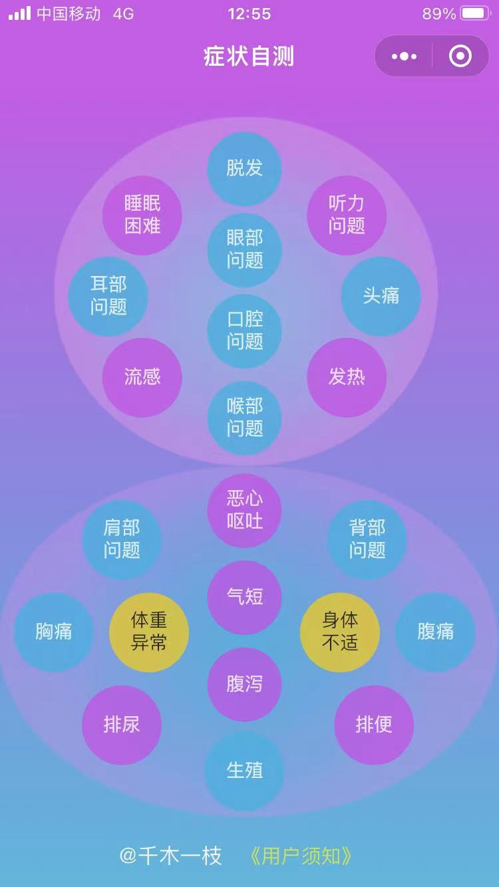

# 家庭医生
大学做毕业设计时，开发过一款根据症状自我评估病因的“家庭医生”。十几年过去了，当年在宿舍边写查资料边写代码的情景还时常浮现现在脑海，时过境迁，Delphi的辉煌已成历史，如今由小程序驱动当年的数据库，让尘封毕设的“家庭医生”重获新生。疫情当下，献给那些封控在家，不方便去医院的人，用这样一款小程序对症状进行自我评估，做到心中有数。

 **特别提醒：“** 家庭医生”小程序是为了方便您根据症状进行自我评估。本程序是在军事医学科学出版社《家庭保健百科全书》的基础上，按照情景对话式风格设计。 本程序的亮点在于用一种轻量级的问答逻辑方案，完全利用小程序在手机端完成计算，无须访问后台数据库。

目前已经开放的疾病有：
| 序号 | 疾病 | 是否开放 |
|-----|------|---------|
| 1 | 头痛 | 是 |
| 2 | 恶心呕吐 | 是 |
| 3 | 发热 | 是 |

#### 程序效果截图
已经发布微信小程序的效果：

请扫码体验：

#### 问题数据库设计

1. 毕业设计时的版本：

| question_id | answer_code | parent_id | question_type | question |
|-------------|-------------|-----------|---------------|----------|
| 1           | 1           | 0         | 101           | 问题一      |
| 2           | 0           | 0         | 101           | 问题2      |
| 3           | 1           | 1         | 101           | 问题3      |
| 4           | 0           | 1         | 101           | 问题4      |

字段说明：

- question_id：主键，问题编码
- answer_code： 病人回答，只有是否两个状态
- parent_id： 上个问题编码
- question_type： 问题类目，发烧、腹痛等
- question：  详细的问题描述

2. 现在小程序版本的数据结构
为了简化数据结构，提升检索效率。将 parent_id 和 answer_code合并为问题主键，这样查找下个问题会更加快捷。
为了便于理解，parent_id和answer_code都采用二进制编码方式。问题编码最终格式为： `question_type@question_type+answer_code`

例如：发热问题的question_type=124
- 第一个问题
`'124@1': '发热，疼痛，寒战，恶心，呕吐或腹泻？'`
- 回答否，则拼接 **0**  
`'124@10': '剧烈头痛，脖子发硬并伴有喷射状呕吐，感到普通光线刺眼？'`
- 回答是，则拼接 **1** 
`'124@11': '可能是流感，重感冒，胃肠感染。医学术语为流行性感冒、上呼吸道感染和胃肠炎。使用治疗感冒症状、流感症状或腹泻的非处方药物。'`
- 以下类推

#### 代码结构

 _代码还在梳理中，梳理完成之后放出代码，敬请关注_ 
